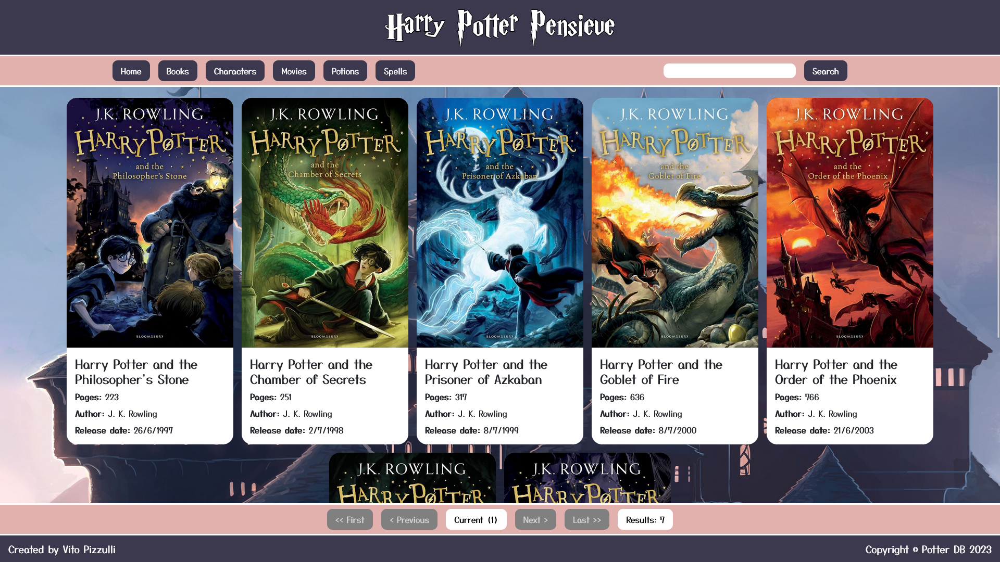

# Harry Potter Pensieve

## Descrizione
Harry Potter Pensieve è una web-app che ti permette di esplorare il mondo di Harry Potter scegliendo tra diverse categorie: Libri, Personaggi, Film, Pozioni e Incantesimi. I risultati sono visualizzati come card contenenti le informazioni principali, e sono organizzati in pagine da poter sfogliare in maniera semplice e intuitiva.

## Funzionalità
- Selezione di una categoria tra Libri, Personaggi, Film, Pozioni e Incantesimi.
- Visualizzazione di tutti gli elementi della categoria scelta, organizzati in pagine.
- Ricerca di un elemento specifico nella categoria scelta, tramite testo.
- Visualizzazione di una card con un'immagine e le informazioni principali per ogni elemento.
- Visualizzazione di un'immagine di default nel caso in cui un elemento non abbia un'immagine associata.

## Tecnologie utilizzate
- Node.js
- Express
- EJS
- Body-parser
- Axios

## Installazione e Avvio Locale
1. Assicurati di avere Node.js installato sul tuo computer.
2. Clona o scarica il repository del progetto sul tuo computer.
3. Naviga nella directory del progetto tramite il terminale.
4. Esegui il comando `npm install` per installare le dipendenze.
5. Avvia il server locale con il seguente comando: `node index.js`.

## Come Utilizzare
1. Apri il tuo browser e vai all'indirizzo `localhost:3000` per utilizzare l'applicazione.
2. Sulla pagina principale, scegli una categoria tra Libri, Personaggi, Film, Pozioni e Incantesimi cliccando sul relativo bottone.
3. Verranno visualizzati tutti gli elementi relativi alla categoria scelta, organizzati in pagine. Puoi navigare tra le pagine usando i pulsanti in basso.
4. Se vuoi cercare un elemento specifico nella categoria scelta, scrivi il testo nella barra di ricerca in alto e premi invio. Verranno mostrati solo gli elementi che corrispondono al testo inserito.
